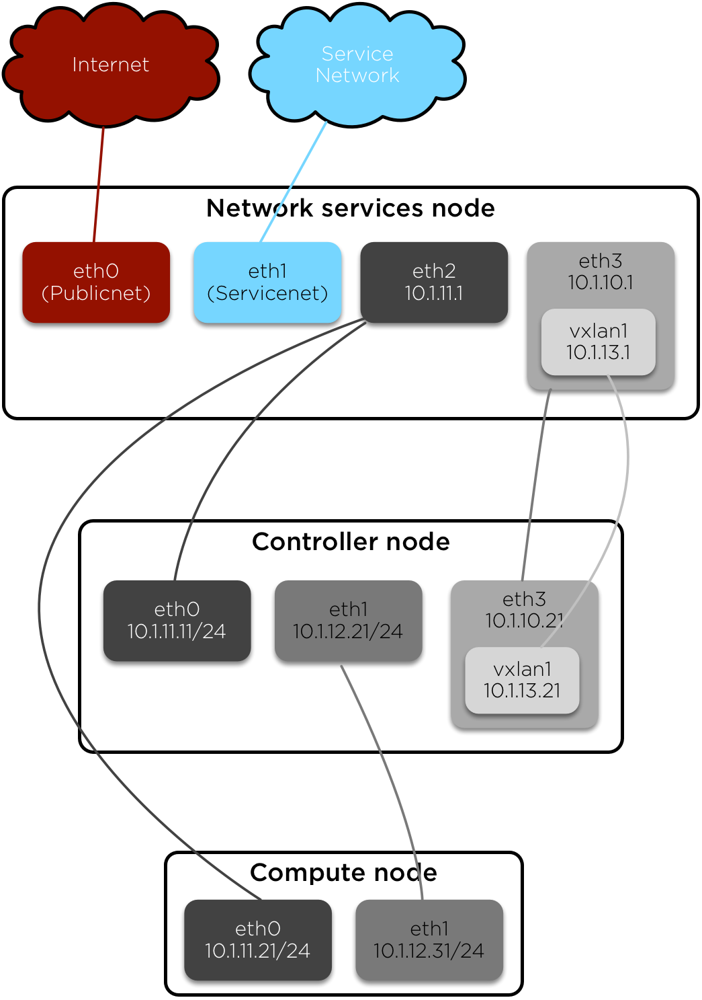

=============================================
How-To: OpenStack on RAX CentOS Cloud Servers
=============================================

This how-to provides instructions for building the prerequisite
infrastructure for installing multi-host OpenStack environments on RAX
cloud servers using the official installation guide.

The infrastructure contains three OpenStack nodes operating on private
(tenant) networks managed by a network services (jump/firewall) node.
The latter protects the OpenStack nodes from direct internet access and
provides internet connectivity to instances in the environment.

Overview
~~~~~~~~

- Prepare the Rackspac cloud environment.
- Build and configure network services (jump/firewall) node.
- Build and configure OpenStack nodes.
- Install and configure OpenStack services with minor modifications to
  the official installation guide.

Network architecture
~~~~~~~~~~~~~~~~~~~~

Prepare cloud environment
~~~~~~~~~~~~~~~~~~~~~~~~~

Keys
----

-  Upload a public key.

Networks
--------

In the Rackspace Cloud Control Panel, select :guilabel:`Networks` in the
:guilabel:`Networking` tab, and create the following networks:

#. net-osmgmt1

   - 10.1.11.0/24

#. net-osint1

   - 10.1.12.0/24

#. net-osext1

   - 10.1.13.0/24

Network services node (hst-ns1)
~~~~~~~~~~~~~~~~~~~~~~~~~~~~~~~

#. Create a cloud server named hst-ns1.

   - OS: CentOS 7 (PVHVM)
   - Flavor: 1 GB General Purpose v1
   - Networks: PublicNet, ServiceNet

   .. note::

      Adding multiple tenant networks simultaneously yields inconsistent
      network interface device names. This guide adds one tenant network at a
      time as it becomes necessary. Also, changing tenant networks after
      configuration erases changes made in this guide.

#. Access the node from a terminal using the IP address assigned by
   Rackspace.

   .. code-block:: console

      $ ssh root@<hst-ns1_IP_ADDRESS>

#. Update the node.

   .. code-block:: console

      # yum update -y

#. Install additional packages.

   .. code-block:: console

      # yum install ntp shorewall -y

#. Reboot the node:

   .. code-block:: console

      # reboot now

Configure additional network interfaces
---------------------------------------

#. In the cloud control panel, add the *net-osmgmt1* network to the node.

#. In the cloud control panel, add the *net-osext1* network to the node.

#. Edit */etc/sysconfig/network-scripts/ifcfg-eth2*. Do not touch the
   HWADDR line, as this is determined by the system:

   .. code-block:: ini

      # Label net-osmgmt1
      DEVICE=eth2
      BOOTPROTO=static
      HWADDR=bc:76:4e:18:03:b8
      IPADDR=10.1.11.1
      NETMASK=255.255.255.0
      ONBOOT=yes
      NM_CONTROLLED=no

#. Edit */etc/sysconfig/network-scripts/ifcfg-eth3*. Do not touch the
   HWADDR line, as this is determined by the system:

   .. code-block:: ini

      # Label net-osext1
      DEVICE=eth3
      BOOTPROTO=static
      HWADDR=bc:76:4e:18:03:c2
      IPADDR=10.1.10.1
      NETMASK=255.255.255.0
      ONBOOT=yes
      NM_CONTROLLED=no

#. Create *~/vxlan1.sh* with the following content:

   .. code-block:: bash

      #!/bin/bash

      modprobe vxlan
      ip link add vxlan1 type vxlan id 1 group 239.0.0.1 dev eth3 dstport 4789
      ip addr add 10.1.13.1/24 brd 10.1.13.255 dev vxlan1

#. Run the *vxlan1.sh* script:

   .. code-block:: console

      # bash -x ~/vxlan1.sh

   This script needs to be run every time the node boots.

Configure the firewall service
------------------------------

#. Set the following options in the */etc/shorewall/shorewall.conf* file:

   .. code-block:: text

      STARTUP_ENABLED=Yes
      ...
      IP_FORWARDING=On

#. Edit the */etc/shorewall/interfaces* file:

   .. code-block:: text

      ext eth0 routefilter,tcpflags
      rax eth1
      osm1 eth2
      ose1 eth3
      os1t vxlan1

#. Edit the */etc/shorewall/masq* file:

   .. code-block:: text

      eth0 10.1.11.0/24
      eth0 10.1.13.0/24

#. Edit the */etc/shorewall/policy* file:

   .. code-block:: text

      $FW all ACCEPT
      ext all REJECT
      rax all ACCEPT
      osm1 all ACCEPT
      ose1 all ACCEPT
      os1t all ACCEPT

#. Edit the */etc/shorewall/rules* file:

   .. code-block:: text

      Ping/ACCEPT ext $FW
      SSH/ACCEPT ext $FW
      #DNAT ext osm1:10.1.11.11  tcp    www
      #DNAT ext osm1:10.1.11.11  tcp    6080

   .. note::

      Uncomment the DNAT rules and restart Shorewall as necessary to
      enable remote access to the dashboard and instance consoles in the
      OpenStack environment.

#. Edit the */etc/shorewall/zones* file:

   .. code-block:: text

      fw firewall
      ext ipv4
      rax ipv4
      osm1 ipv4
      ose1 ipv4
      os1t ipv4

#. Check the shorewall configuration.

   .. code-block:: console

      # shorewall check

#. Start the firewall service:

   .. code-block:: console

      # systemctl start shorewall

#. Edit */etc/resolv.conf* and add the Google DNS servers:

   .. code-block:: text

      nameserver 8.8.8.8
      nameserver 8.8.4.4

#. Test network connectivity to the internet by pinging openstack.org:

   .. code-block:: console

      # ping openstack.org
      PING openstack.org (162.242.140.107) 56(84) bytes of data.
      64 bytes from 162.242.140.107: icmp_seq=1 ttl=50 time=181 ms
      64 bytes from 162.242.140.107: icmp_seq=2 ttl=50 time=180 ms
      ...

#. Generate an ssh key for accessing other nodes:

   .. code-block:: console

      # ssh-keygen -t rsa -b 2048 -C "ns1" -P "" -f .ssh/id_rsa

OpenStack controller node (hst-os1ctl1)
~~~~~~~~~~~~~~~~~~~~~~~~~~~~~~~~~~~~~~~

#. Create a cloud server named hst-os1ctl1, removing all networks except the
   **net-osmgmt1** network:

   - OS: CentOS 7 (PVHVM)
   - Flavor: 4 GB General Purpose v1
   - Networks: net-osmgmt1

#. In the cloud control panel, add the *net-osint1* network to the
   node.

#. In the cloud control panel, add the *net-osext1* network to the
   node.

#. Access the node from the network services node (hst-ns1) using the IP
   address assigned by Rackspace on the *net-osmgmt1* network:

   .. code-block:: console

      # ssh-copy-id -i .ssh/id_rsa.pub root@10.1.11.2
      # ssh root@10.1.11.2

   .. note::

      The node cannot access the internet without additional configuration.

Configure network interfaces
----------------------------

#. Edit */etc/sysconfig/network-scripts/ifcfg-eth0*. Do not touch the
   HWADDR line, as this is determined by the system:

   .. code-block:: ini

      # Label net-osmgmt1
      DEVICE=eth0
      BOOTPROTO=static
      HWADDR=bc:76:4e:18:03:b8
      IPADDR=10.1.11.11
      NETMASK=255.255.255.0
      GATEWAY=10.1.11.1
      ONBOOT=yes
      NM_CONTROLLED=no

#. Edit */etc/sysconfig/network-scripts/ifcfg-eth1*. Do not touch the
   HWADDR line, as this is determined by the system:

   .. code-block:: ini

      # Label net-osint1
      DEVICE=eth1
      BOOTPROTO=static
      HWADDR=bc:76:4e:18:03:b8
      IPADDR=10.1.12.21
      NETMASK=255.255.255.0
      ONBOOT=yes
      NM_CONTROLLED=no

#. Edit */etc/sysconfig/network-scripts/ifcfg-eth2*. Do not touch the
   HWADDR line, as this is determined by the system:

   .. code-block:: ini

      # Label net-osext1
      DEVICE=eth2
      BOOTPROTO=static
      HWADDR=bc:76:4e:18:03:c2
      IPADDR=10.1.10.21
      NETMASK=255.255.255.0
      ONBOOT=yes
      NM_CONTROLLED=no

#. Create *~/vxlan1.sh* with the following content:

   .. code-block:: bash

      #!/bin/bash

      modprobe vxlan
      ip link add vxlan1 type vxlan id 1 group 239.0.0.1 dev eth2 dstport 4789
      ip addr add 10.1.13.21/24 brd 10.1.13.255 dev vxlan1

#. Run the *vxlan1.sh* script:

   .. code-block:: console

      # bash -x ~/vxlan1.sh

   This script needs to be run every time the node boots.

#. Edit the */etc/hosts* file:

   .. code-block:: text

      # hst-os1ctl1
      10.1.11.11  hst-os1ctl1

      # hst-os1cpu1
      10.1.11.21  hst-os1cpu1

   .. note::

      Comment out or remove any existing lines containing *hst-os1ctl1*.

#. Edit */etc/resolv.conf* and add the Google DNS servers:

   .. code-block:: text

      nameserver 8.8.8.8
      nameserver 8.8.4.4

#. Reboot the node:

   .. code-block:: console

      # reboot now

Test and update
---------------

#. Access the node from the network services node using the new IP
   address on the *net-osmgmt1* network:

   .. code-block:: console

      # ssh root@10.1.11.11

#. Test network connectivity to the internet by pinging openstack.org:

   .. code-block:: console

      # ping openstack.org
      PING openstack.org (162.242.140.107) 56(84) bytes of data.
      64 bytes from 162.242.140.107: icmp_seq=1 ttl=50 time=181 ms
      64 bytes from 162.242.140.107: icmp_seq=2 ttl=50 time=180 ms
      ...

#. Update the node:

   .. code-block:: console

      # yum update -y

#. Reboot the node:

   .. code-block:: console

      # reboot now

OpenStack compute node (hst-os1cpu1)
~~~~~~~~~~~~~~~~~~~~~~~~~~~~~~~~~~~~

#. Create a cloud server, removing all networks except the *net-osmgmt1*
   network:

   - OS: CentOS 7 (PVHVM)
   - 4 GB General Purpose v1 (supports several CirrOS instances)
   - 8 GB General Purpose v1 (supports a couple of Ubuntu/Fedora instances)
   - Networks: net-osmgmt1

#. In the cloud control panel, add the *net-osint1* network to the
   node.

#. Access the node from the network services node using the IP address
   assigned by Rackspace on the *net-osmgmt1* network:

   .. code-block:: console

      # ssh-copy-id -i .ssh/id_rsa.pub root@10.1.11.2
      # ssh root@10.1.11.2

   .. note::

      The node cannot access the internet without additional configuration.

Configure network interfaces
----------------------------

#. Edit */etc/sysconfig/network-scripts/ifcfg-eth0*. Do not touch the
   HWADDR line, as this is determined by the system:

   .. code-block:: ini

      # Label net-osmgmt1
      DEVICE=eth0
      BOOTPROTO=static
      HWADDR=bc:76:4e:18:03:b8
      IPADDR=10.1.11.21
      NETMASK=255.255.255.0
      GATEWAY=10.1.11.1
      ONBOOT=yes
      NM_CONTROLLED=no

#. Edit */etc/sysconfig/network-scripts/ifcfg-eth1*. Do not touch the
   HWADDR line, as this is determined by the system:

   .. code-block:: ini

      # Label net-osint1
      DEVICE=eth1
      BOOTPROTO=static
      HWADDR=bc:76:4e:18:03:b8
      IPADDR=10.1.12.31
      NETMASK=255.255.255.0
      ONBOOT=yes
      NM_CONTROLLED=no

#. Edit the */etc/hosts* file:

   .. code-block:: text

      # hst-os1ctl1
      10.1.11.11  hst-os1ctl1

      # hst-os1cpu1
      10.1.11.21  hst-os1cpu1

   .. note::

      Comment out or remove any existing lines containing *hst-os1cpu1*.

#. Edit */etc/resolv.conf* and add the Google DNS servers:

   .. code-block:: text

      nameserver 8.8.8.8
      nameserver 8.8.4.4

#. Reboot the node:

   .. code-block:: console

      # reboot now

Test and update
---------------

#. Access the node from the network services node using the new IP
   address on the *net-osmgmt1* network:

   .. code-block:: console

      # ssh root@10.1.11.21

#. Test network connectivity to the internet by pinging openstack.org:

   .. code-block:: console

      # ping openstack.org
      PING openstack.org (162.242.140.107) 56(84) bytes of data.
      64 bytes from 162.242.140.107: icmp_seq=1 ttl=50 time=181 ms
      64 bytes from 162.242.140.107: icmp_seq=2 ttl=50 time=180 ms
      ...

#. Update the node:

   .. code-block:: console

      # yum update -y

#. Reboot the node: console

   .. code-block:: console

      # reboot now

Install and configure OpenStack services
~~~~~~~~~~~~~~~~~~~~~~~~~~~~~~~~~~~~~~~~

Use the `Draft OpenStack Installation Guides
<http://docs.openstack.org/project-install-guide/draft/>`_ with the
following changes:

- Configuring the basic environment on all nodes:

  - Skip the network configuration sections.
  - Use 10.1.11.1 (network services node) as the NTP server.

- Configuring the Compute service on the compute node:

  - Use *qemu* instead of *kvm* virtualization.

- Configuring the Networking service on the network node:

  - Add the *vxlan1* interface as a port on the *br-ex* bridge.

- Creating initial networks.

  - Use the following command for the subnet on the external network:

    .. code-block:: console

       $ neutron subnet-create ext-net --name ext-subnet \
       --allocation-pool start=10.1.13.101,end=10.1.13.200 \
       --disable-dhcp --gateway 10.1.13.1 10.1.13.0/24

  .. note::

     After performing the initial tenant network creation procedure,
     try pinging 10.1.13.101 from the network services node.
